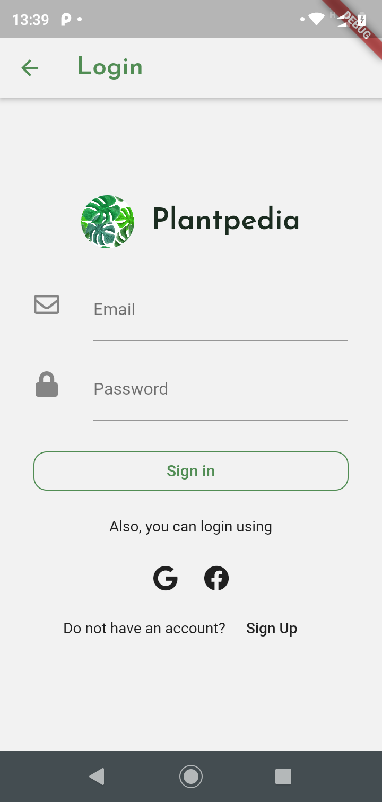
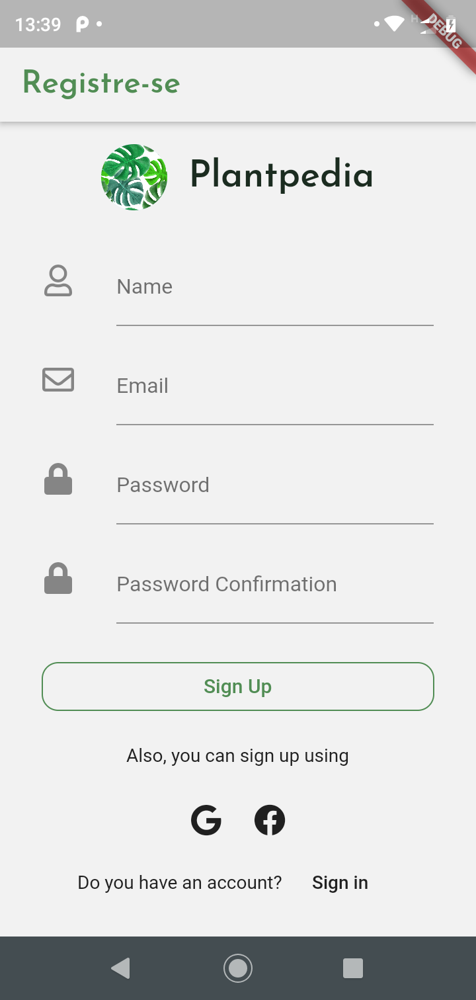
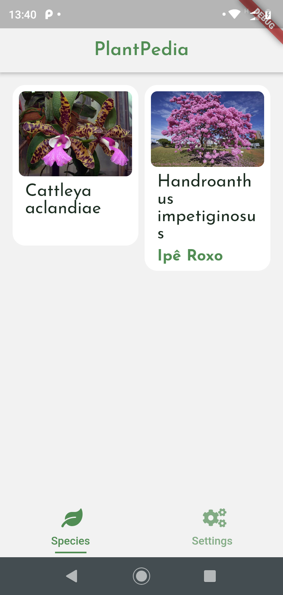
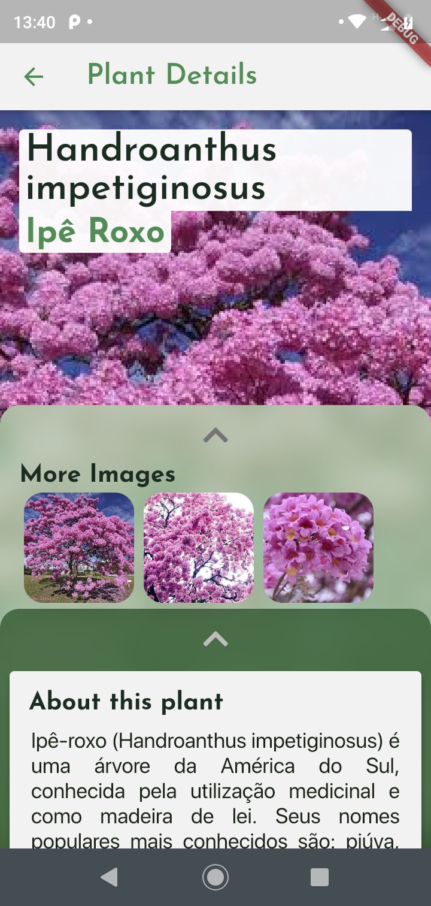
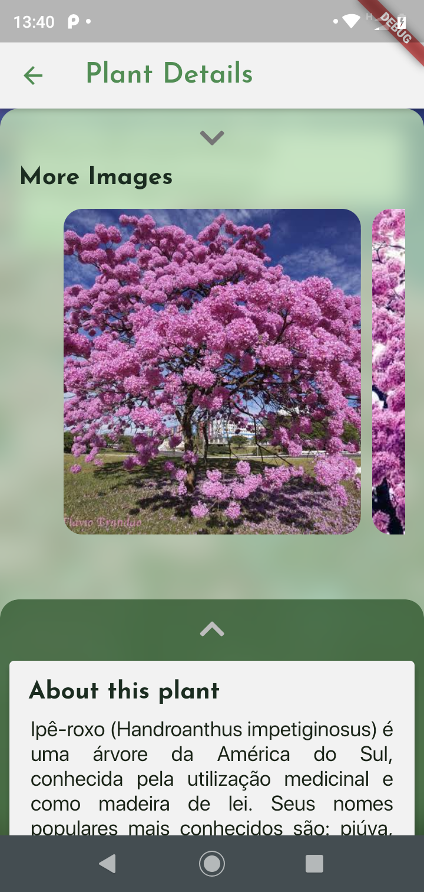
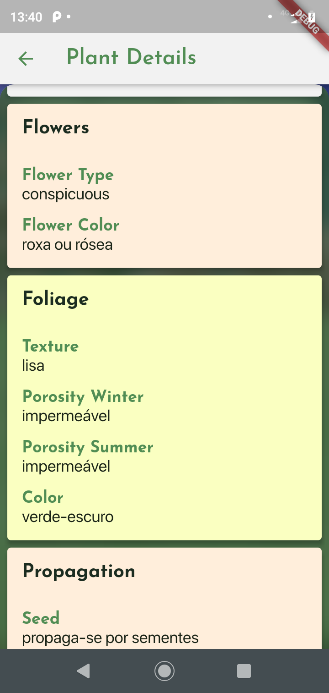
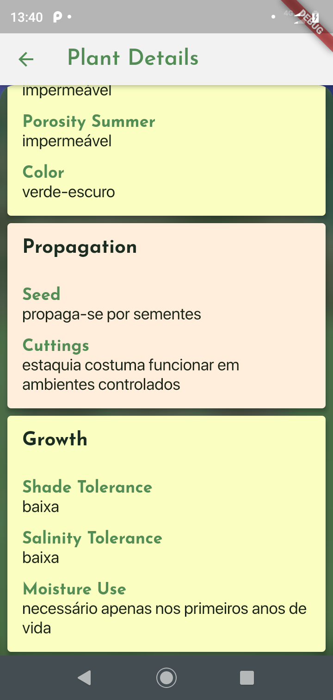
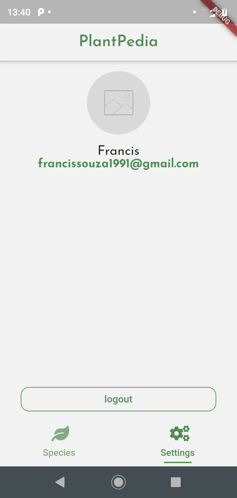

# Plantpedia

A simple app that gives you access to [PlantPedia](https://plantpedia-server.herokuapp.com/) plant library hosted at Heroku.

## Features

- Redux as satate management library
- Supports dark mode
- Automatic Internationalization ('em-US', 'pt-BR')

## Screenshots

### Sign In

### Sign Up

### Species List

### Species Details

### Logout

